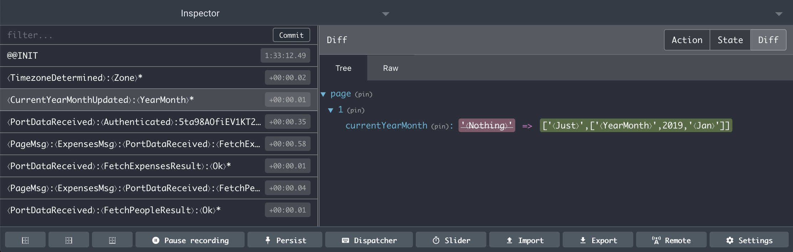

# elm-monitor

Monitor your elm program with [redux-devtools](https://github.com/reduxjs/redux-devtools) during development. It's really just for monitoring and inspecting state and actions. Action replay (time travel) is not supported.



## How to use it?

1. Install the dependency: `$ npm install elm-monitor`

2. Import and initialize `elm-monitor` in your `index.js`:
   ```
   import monitor from 'elm-monitor';
   ...
   monitor();
   ```

3. Copy or symlink `Monitor.elm` into your source folder, via
   e.g. `ln -s ../node_modules/elm-monitor/src/Monitor.elm src`

4. Import `Monitor.elm` into your `Main.elm` with `import Monitor`

5. Replace `Browser.application` with `Monitor.application` in your `Main.elm`

6. Open Redux Devtools in your browser and reload your app.

### Attention!

You should only use this during development. Elm won't build when `Monitor.elm` is used, because it depends on `Debug.log`.

### What if I don't use `Browser.application`?

Besides being able to monitor `Browser.application`, `Monitor.elm` additionally exports:

- `Monitor.worker` - when using `Platform.worker`
- `Monitor.sandbox` - when using `Browser.sandbox`
- `Monitor.element` - when using `Browser.element`
- `Monitor.document` - when using `Browser.document`

## How does it work under the hood?

It's quite simple. `Monitor.elm` just logs the state on `init` as well as every action and resulting state on `update` to the browser console. `monitor.js` connects to redux-devtools, patches `console.log` to extract messages logged by `Monitor.elm`, parses and transforms the log messages using `elm/parser` (thx [@ChristophP](https://github.com/ChristophP)) and passes them over to redux-devtools.

## How does it map Elm to JS data structures?

* Int, Float -> Number
* Char, String -> String
* Unit `()` -> `null`
* List -> Array
* Tuple -> Array
* Type constructor -> Array `[⟨Ctor⟩, param1, param2]` or String `⟨Nothing⟩`

